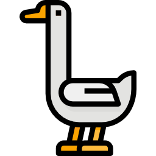

<p align="center">
  
  <br/>
  <h3 align="center">aminbeigi.com</h3>
</p>
<br />

<p align="center">
  <a href="../../issues"></a>
  <a href="../../pulls"></a>
  
</p>

## 📖 Description

This repository hosts the source code for my personal website and blog,
[aminbeigi.com](http://aminbeigi.com/).

The website is built using React, Typescript, Tailwind CSS and Vite.


## ⚙️ Requirements

-   Node.js (v20.16.0+)
-   npm
-   Python (v3.10+)
-   Git

## 🛠️ Installation and Setup

1. Clone the repository:

```
git clone https://github.com/aminbeigi/aminbeigi.com
cd aminbeigi.com
```

2. Install dependencies:

```
npm install
```

3. Start the development server:

```
npm run dev
```

Your app should now be running at `http://localhost:3000`.


## 🎯 Contributions

Contributions are always welcome!  
Just make a [pull request](../../pulls).

## 📜 License

MIT License.
